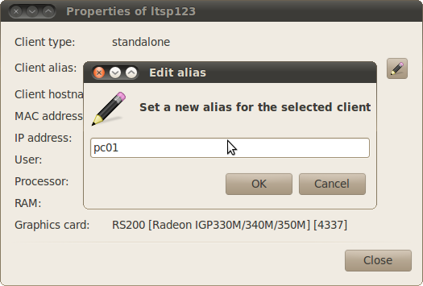

# Client aliases

> 💡 **Tip:**
  If using LTSP, see also [ltsp.conf groups](ltsp-groups.md).

In some environments, clients have appropriate hostnames, e.g. client01,
library02, lab03... Unfortunately in some setups that's not easily
accomplished, and the clients get random hostnames like ltsp123, based on the
dynamic IP they get from the DHCP server.

Aliases can help there. Even though the client hostname will continue to be
random, the alias will always be the same, because it matches the MAC address
of the client, not its IP.

To create an alias, first [create a group](groups.md) and add the client in it;
then right-click a client, select Information and then click on the button with
the pencil icon.

