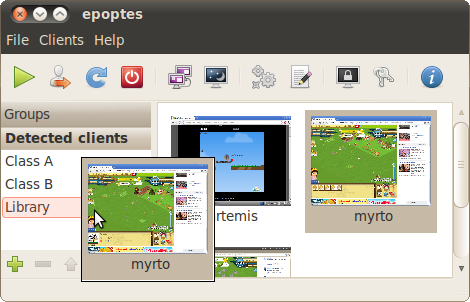

# Working with groups

You can create and use groups in Epoptes for a number of reasons:

- To organize and manage groups of workstations. For example, a school may have a single LTSP server serving 4 classrooms. Teachers using Epoptes would create 4 groups and drag 'n' drop clients from the Detected computers group to the respective classroom groups.
- To be able to save detected clients and boot them with Wake on LAN, if they support it. That cannot be done from the Detected computers group as obviously it doesn't display offline clients.

Unfortunately the ability to drag 'n' drop clients into groups is not so obvious due to some GTK restrictions. Let's step through the procedure of creating and filling a group:

- Click on the [+] Create a new group button at the lower left corner of Epoptes (see the picture at the right).
- Enter an appropriate name for your group, e.g. Library, and press Enter.
- Switch to the Detected clients group.
- Select a single client. Unfortunately again due to GTK restrictions, Epoptes doesn't support drag 'n' dropping multiple clients yet.
- Drag the client over the new group you've created. There's another gotcha here: aim for the middle of the group line, so that the group name is highlighted (light red color in the picture). If you don't aim correctly it won't work, a horizontal line will appear between the groups and dropping the client won't have any effect.

