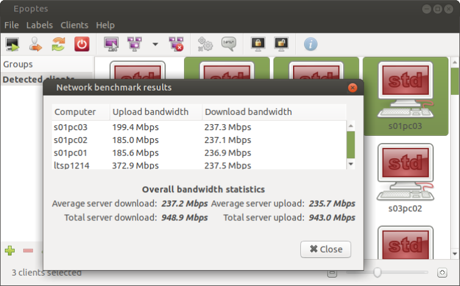

# LAN benchmark

> 💡 **Tip:**
  It's recommended that the epoptes server and the clients are connected to
  the same switch. The switch should have at least a gigabit port and the
  server should be connected to it. Ideally, the server could have two NICs in
  bonded mode, which would be attached to two ports on the same switch .

A healthy local network is essential for Epoptes and [LTSP](https://ltsp.org),
but also for unhindered Internet access. To test your LAN, start `epoptes`
and select your clients **in groups of four**. Go to the ***Clients*** ▸
***Network benchmark*** menu and click the ***Start*** button. You'll see a
dialog similar to the following:

Based on the results, our conclusions about the LAN state would be:

- When the server has 2 bonded gigabit NICs, we should see more than 1.5 Gbps
  server upload/download, and around 400 Mbps client upload/download.
- In the more usual case where the server and the clients have a single gigabit
  NIC, we should see around 900 Mbps for the server and 240 Mbps for the
  clients.
- If the server shows less than 100 Mbps, then it's not connected directly to
  a single gigabit port on the switch as it should, so it's functioning 10
  times slower.
- If some of the clients show less than 100 Mbps, it means that:
    - their NIC is 100 Mbps,
    - or there's a 100 Mbps chained switch somewhere,
    - or a UTP cable has 4 cores instead of 8 that are needed for gigabit,
    - or some UTP cable core (or wall socket) is damaged and the NIC can't
      sync to gigabit speeds.

> 📝 **Note:**
 Had we selected all clients (e.g. 12), they'd all show less than 100 Mbps
 due to sharing the bandwidth, so we wouldn't have been able to pinpoint the
 ones that show less than 100 Mbps due to a hardware issue.
